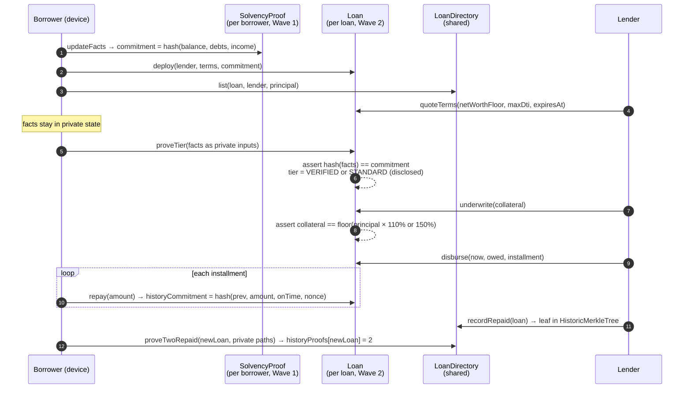

# Kymider - prove solvency privately, post 110% collateral instead of 150%

[](https://github.com/Turnless/kymider/actions/workflows/ci.yml)
[](https://turnless.github.io/kymider/)
[](https://midnight.network/)
[](./LICENSE)

**Midnight Buildathon · Wave 2 · Compact + MidnightJS**

DeFi lenders cannot assess a borrower without seeing their finances, so every
borrower posts the same over-collateral, typically 150%. Kymider lets a borrower
prove in zero knowledge that their committed balance, debts and income clear the
lender's bar, and the `Loan` contract then enforces 110% collateral for that
borrower and refuses any other figure. The verdict, the collateral and the
repayment schedule settle on Midnight's public ledger; the figures behind the
verdict stay in the borrower's private state and never enter a transaction.

> **The lender learns one bit, and the contract holds it to that bit:**
> 10,000 borrowed against 11,000 collateral, not 15,000.

| Live console | Video | Deck | On-chain proof | Tests | What is simulated |
|---|---|---|---|---|---|
| [turnless.github.io/kymider](https://turnless.github.io/kymider/) | [{{VIDEO_URL}}]({{VIDEO_URL}}) | [DECK.html](./hackathon/wave2/DECK.html) · [PDF]({{DECK_PDF_URL}}) | [PROOF.md](./PROOF.md) <!-- VERIFY: PROOF.md exists and lists the Preprod tx hashes --> | 131 offline + 18 devnet ([below](#tests-and-scripts)) | Money: no token moves. Console: contracts run in-browser, no proofs ([details](#what-is-real-and-what-is-not)) |

---

## Judge fast path

Five minutes, no keys, nothing to install. Every refusal you see below is the
contract's own `assert` message, raised by the compiled `Loan` and
`LoanDirectory` contracts running in your browser.

<!-- VERIFY: the Wave 2 loan screens are merged to main and published to
     GitHub Pages (Pages deploys only from main, see .github/workflows/ci.yml),
     and the screen names and routes below match the shipped console. -->

1. **Open** <https://turnless.github.io/kymider/> and click **Open the console**.
   You start as the borrower. Your facts (balance, debts, income) are on the
   **Private facts** screen; only their hash is on the ledger.
2. **Apply.** Borrower → **Loans** → **Apply**: pick a lender, principal
   10,000, 3 installments. The application shows both prices: 11,000 collateral
   if verified, 15,000 otherwise. This deploys a `Loan` instance and lists it in
   the `LoanDirectory`.
3. **Quote.** Switch to **Lender** (bottom-left) → **Applications** → open the
   loan → **Quote**: a net-worth floor, a maximum DTI and an expiry.
4. **Prove the tier.** Switch back to **Borrower** → **Prove tier**. The
   `proveTier` circuit checks the facts against the on-ledger commitment and the
   quote, and writes one value: `VERIFIED` or `STANDARD`.
5. **Underwrite at 110%.** As the lender, open the loan. You see the tier and
   the collateral it fixes. Balance, debts and income read *not disclosed*.
   Click **Underwrite**: collateral 11,000.
6. **Watch the contract refuse 150%.** On a second verified application, ask
   for 15,000 instead. The contract refuses with
   `collateral does not match the tier`. A lender cannot quietly price a
   verified borrower as unverified.
   <!-- VERIFY: the console offers a way to submit a non-tier collateral figure.
        As of commit a0337b1, LoanDesk.underwrite(address) computes the
        collateral itself and takes no figure, so this step needs a dedicated
        control (e.g. "Ask for 150%") on the underwriting screen. -->
7. **Disburse and repay.** Lender → **Disburse**. Borrower → **Repay** three
   times (on a 1,000 principal at 10%: 367, 367, 366). Use **Advance time** to
   pay one installment late and see `latePayments` move; lateness is decided by
   block time, not by the borrower.
8. **Prove history.** With two loans repaid and recorded by their lender, open a
   new application and **Prove history**. The directory records "2 repaid loans"
   for that application, and not which loans, lenders or amounts.
9. **Auditor check (Wave 3 preview).** Borrower → **Disclose** on a repaid loan,
   then open **/app/audit**, paste the disclosure, and **Verify**. The auditor
   recomputes the payment chain and checks it lands on the loan's on-chain
   `historyCommitment`. Edit one amount and verify again: it fails.
   <!-- VERIFY: /app/audit route exists and contracts/audit.ts is implemented
        (it is signatures only at commit a0337b1). -->
10. **On-chain.** Open **Live** in the console to read the Preprod instances
    through the indexer, or see [PROOF.md](./PROOF.md) for the transaction
    hashes. <!-- VERIFY: Live view (Lace connect + indexer reads) shipped;
    Preprod deploy done. Otherwise replace this step with "pending". -->

---

## What changed since Wave 1

Wave 1 shipped a solvency proof (`SolvencyProof` + `Registry`). Wave 2 turns it
into a loan with an enforced price. All of the following was built between
Sep 27 and Oct 17, 2026, on the [`wave2`](https://github.com/Turnless/kymider/tree/wave2) branch.

| | Wave 1 | Wave 2 |
|---|---|---|
| Contracts | 2 (`SolvencyProof`, `Registry`), 9 exported circuits | 4: + [`Loan`](./contracts/loan.compact) (7 circuits) and [`LoanDirectory`](./contracts/loanDirectory.compact) (4 circuits) |
| What a proof buys | A PASS/FAIL attestation | A collateral ratio: 110% vs 150%, enforced in-circuit with an exact-floor check |
| Lifecycle | Claim → verdict | Apply → quote → prove tier → underwrite → disburse → repay / default |
| Time | None | Block time: quote expiry, due dates, late flags, a 3-day grace period before default |
| History | None | Payment-history hash chain per loan; two-repaid-loans proof over a `HistoricMerkleTree` |
| Offline tests | 49 | 131 (+47 `Loan`, +18 `LoanDirectory`, +12 client-arithmetic sweep, +5 Wave 1) |
| Devnet simulation | 11 cases, 2 wallets | 18 cases (+7 Wave 2 lifecycle), run in CI on every push |
| Client | `KymiderClient` | + [`LoanClient`](./client/loans.ts), `npm run loan:deploy`, `npm run loan:demo` |
| Console | Solvency screens | + loan screens for borrower and lender, portfolio, auditor preview <!-- VERIFY: loan screens, portfolio and /app/audit merged --> |
| Chain | Local devnet only | Preprod deployment, indexer-backed Live view <!-- VERIFY: Preprod deploy + Live view; else "pending owner wallet" --> |
| AKINDO record | Repo not connected, product private, tagged "Base" | Repo connected, public, tagged Midnight <!-- VERIFY: owner applied the AKINDO fixes --> |

What Wave 1 judges asked entries for, and where it is now
([analysis](./hackathon/wave1-results.md)): *say exactly which parts need privacy* (see
the [dual-ledger table](#the-dual-ledger-what-is-private-what-is-public));
*add audio to the video* (the Wave 2 video is narrated); *show a public-testnet
transaction* ([PROOF.md](./PROOF.md) <!-- VERIFY -->).

---

## The problem

Over-collateral is the price DeFi lending pays for knowing nothing about the
borrower. A protocol cannot ask for bank statements, so it treats every borrower
as the worst case and asks for 150% or more. A borrower with a clean balance
sheet pays the same as one without.

The obvious fix, disclosing finances to the lender, is the one the setting
cannot accept: it puts a full financial history on a public chain or in a
counterparty's database. The lender does not even want the data. It wants one
answer: does this borrower clear our bar?

Kymider gives the lender that answer and nothing else, and makes the answer
binding. At 110% instead of 150%, the same collateral supports 36% more
borrowing (1.5 / 1.1 = 1.36), or the same loan needs 27% less collateral
(4,000 of 15,000).

---

## How it works



The full state machine is in [`contracts/loan.compact`](./contracts/loan.compact)
(header comment) and [`docs/architecture-wave2.md`](./docs/architecture-wave2.md).

### Why one `Loan` instance per loan

On Midnight, private state belongs to one contract instance. A shared loan
contract would have to hold every borrower's secrets, or none. One instance per
loan keeps each borrower's history seed and payment nonces scoped to that loan,
and lets every circuit check its caller against two keys stored at deploy
(`borrower`, `lender`). The shared `LoanDirectory` holds only public listings
and Merkle leaves.

### Why the client computes the quotients

Compact has no division operator. Collateral (`principal × 1.1`), amount owed
(`principal × (1 + rate)`) and installment (`owed / n`) are all quotients. The
client computes them in [`client/proof/loanMath.ts`](./client/proof/loanMath.ts)
and the circuit checks each one by cross-multiplication: `isFloorOfBps` accepts
`value` only if `value × 10000 ≤ principal × ratio < (value + 1) × 10000`, and
`isCeilOfShare` does the same for the ceiling. This is why a 150% ask on a
verified borrower is refused rather than tolerated: only the exact floor of
110% passes. [`tests/unit/loanMath.unit.test.ts`](./tests/unit/loanMath.unit.test.ts)
sweeps terms from a principal of 1 to 2^40 through both to prove they agree.

### Why payment nonces are derived, not random

Each repayment folds `(amount, on-time flag, nonce)` into the public
`historyCommitment`. The nonce is `hash("kymider:loan:nonce:", historySeed,
previousHead)` ([`contracts/witnesses.ts`](./contracts/witnesses.ts)). Nothing
has to be stored per payment, a failed transaction cannot desynchronise private
state from the chain, and the borrower can rebuild every opening from one seed.
It is keyed to the chain head rather than `paymentsMade` because `repay`
increments the counter before the witness runs.

---

## Midnight integration

| Compact / Midnight feature | Where | What it does here |
|---|---|---|
| Witnesses | `localSk`, `paymentNonce` in [`loan.compact`](./contracts/loan.compact); implementations in [`witnesses.ts`](./contracts/witnesses.ts) | The caller's secret key and the derived payment nonce enter circuits from private state |
| `disclose()` | Every ledger write of a caller-supplied value, e.g. `tier = disclose(qualified ? VERIFIED : STANDARD)` | Makes each disclosure explicit; the compiler rejects an undisclosed private value reaching the ledger |
| `persistentHash` commitments | `commitFacts`, `getDappPubKey`, the history chain, `repaidLeaf` | Binds proofs to committed facts; derives identities; commits payment history |
| `HistoricMerkleTree` + `checkRoot` | `LoanDirectory.repaid`, `proveTwoRepaid` | Proves membership of two repaid-loan leaves against any past root, so later inserts do not invalidate a path |
| Block time | `blockTimeLt/Lte/Gt/Gte` in `quoteTerms`, `underwrite`, `disburse`, `repay`, `markDefault` | Quote expiry, tier expiry, on-time vs late, the grace period, a disburse start no more than 1 hour old |
| `Counter` | `paymentsMade`, `latePayments`, `listingCount` | Public counts the lender can rely on |
| `Map` / `Set` | `listings`, `historyProofs`, `recordedLoans` (directory); `claims`, `authorizedLenders`, `openClaims` (Wave 1) | Indexes and one-shot guards (a loan is recorded once) |
| Enums and structs | `LoanStatus`, `Tier`, `LoanTerms`, `Quote`, `Listing` | Typed public state |
| MidnightJS | [`client/loans.ts`](./client/loans.ts): `deployContract`, `submitCallTx`, indexer public data provider, LevelDB private-state provider | Deploy, prove locally, submit, read state back |
| `compact-runtime` in the browser | [`frontend/src/lib/`](./frontend/src/lib/) | The console runs the same compiled contracts client-side |

### The dual ledger: what is private, what is public

| Datum | Ledger | Who can see it |
|---|---|---|
| Balance, debts, income | **Private** (borrower's device); circuit inputs to `proveTier` only | Borrower |
| Facts commitment `hash(tag, hash(balance, debts, income), salt)` | Public | Anyone; reveals nothing without the facts and the 32-byte salt ([why the salt](#privacy-hardening-in-wave-2)) |
| Facts salt | **Private** (borrower's device) | Borrower |
| Borrower secret key, history seed, payment nonces | **Private** | Borrower |
| Borrower and lender public keys | Public | Anyone |
| Quote: net-worth floor, max DTI, expiry | Public | Anyone |
| Tier (`VERIFIED` / `STANDARD`) and its expiry | Public | Anyone. This is the one bit the borrower discloses |
| Terms, collateral, balance owed, installment, due date | Public | Anyone. A lender must be able to enforce them |
| `paymentsMade`, `latePayments`, `historyCommitment` | Public | Anyone |
| Which loans back a two-repaid-loans proof, their lenders and Merkle paths | **Private** (circuit inputs to `proveTwoRepaid`) | Borrower |
| The fact that an application carries a 2-loan history proof | Public | Anyone |

The privacy claim is narrow on purpose: **the facts behind the tier, and the
loans behind the history proof, are private.** The loan itself is public,
because a lender has to be able to enforce it.

---

## Rubric by rubric

Mapped to the criteria in [`hackathon/program.md`](./hackathon/program.md).

### Engineering & Implementation (40%)

- **Compact contracts that compile:** 4 contracts, 20 exported circuits,
  Compact language 0.23 / toolchain 0.31.1, compiled by the `contracts` job in
  [CI](./.github/workflows/ci.yml) on every push; compiled modules are tracked
  in [`compiled/*/contract/`](./compiled/).
- **Private-state management:** [`contracts/witnesses.ts`](./contracts/witnesses.ts)
  (`LoanPrivateState = { sk, historySeed }`), scoped per contract address in
  [`client/loans.ts`](./client/loans.ts).
- **Dual-ledger model:** [table above](#the-dual-ledger-what-is-private-what-is-public).
- **Refusals as the product:** the exact-floor collateral check, block-time
  lateness, a grace period enforced to the second, forged Merkle paths rejected
  by `checkRoot`.
- **Repository and attribution:** Apache-2.0, `midnightntwrk` topic, wallet and
  provider wiring adapted from `midnightntwrk/example-battleship` (credited in
  each file).

### Quality Assurance & Reliability (15%)

- **131 offline tests** that drive the compiled contracts through simulators
  ([`tests/unit/`](./tests/unit/)), including every refusal, time edge cases to
  the second, and a byte-for-byte rebuild of the history chain from the seed.
- **Mutation-checked:** altering the collateral ratio, a late flag or the proof
  count fails 24 tests ([handoff notes](./hackathon/WAVE2-HANDOFF.md#offline-tests-step-6)).
- **18 devnet cases** with real ZK proofs, two wallets, Midnight node + indexer
  + proof server in Docker, on every push
  ([`tests/simulation/`](./tests/simulation/)).

### Product & Vision (15%)

- One checkable number: 110% instead of 150%.
- Scope stated honestly: lifecycle demo, no token settlement, self-reported
  facts ([honest limits](#honest-limits)).
- Roadmap tied to the limits: attested provenance and a lender allowlist close
  the two largest gaps ([Wave 3](#roadmap)).

### User Experience & Design (15%)

- A console that runs the real contracts with no install, for borrower, lender
  and auditor. <!-- VERIFY: loan screens + auditor preview live -->
- A Live view that connects Lace and reads the deployed instances through the
  indexer. <!-- VERIFY: Live view shipped -->
- Works at phone width (Wave 1 console commit `0d85803`).

### Communication (10%)

- Narrated video, about 2:50: [{{VIDEO_URL}}]({{VIDEO_URL}}).
  Script: [`hackathon/wave2/VIDEO-SCRIPT.md`](./hackathon/wave2/VIDEO-SCRIPT.md).
- Deck: [`hackathon/wave2/DECK.html`](./hackathon/wave2/DECK.html).

### Business Development & Viability (5%)

- **Who:** DeFi lending protocols that want a lower-collateral tier without
  KYC; borrowers with balance sheets the protocol cannot currently see.
- **Adoption path:** one protocol adds a verified tier; the borrower generates
  one proof per loan; no regulatory change is needed. Regulated lenders follow
  through the Wave 3 auditor and attestation channel.

---

## What is real and what is not

| Part | Status |
|---|---|
| Contracts, circuits, asserts | Real. Compiled by CI; the same modules run in tests, the console and the client |
| ZK proofs | Real on the devnet simulation (CI) and on Preprod <!-- VERIFY: Preprod -->. **Not** generated in the browser console: it executes circuits with `compact-runtime` and skips proving |
| Console chain | Simulated in-browser ledger with a controllable block clock. The Live view reads Preprod <!-- VERIFY --> |
| Money | **Simulated.** Collateral, principal and balances are figures in contract state. No token is minted, locked or moved |
| Financial facts | Self-reported. The circuit proves arithmetic on committed figures; it cannot know they are true |
| Lace wallet | <!-- VERIFY: Live view connects Lace --> Live view only; the console's simulated mode needs no wallet |

---

## Threat model

| Attack | Defence | Evidence |
|---|---|---|
| Lender prices a verified borrower at 150% | `underwrite` accepts only `floor(principal × ratio)` for the live tier | `Loan — underwriting` tests |
| Borrower proves with figures other than the committed ones | `proveTier` recomputes the commitment in-circuit | `refuses facts that do not match the commitment` |
| Borrower reuses a tier after the quote lapses | Tier expires with the quote; `underwrite` falls back to 150% | `a lapsed tier falls back to 150%` |
| Borrower claims a late payment was on time | Lateness is `blockTimeLte(nextDueAt)`, not an input | `a payment after its due date counts as late` |
| Lender calls a default early | `blockTimeGt(nextDueAt + 3 days)` | `refuses a default within the grace period, up to its last second` |
| Lender back- or forward-dates disbursement | Start must satisfy `now ≤ block time < now + 1 h` | `refuses a start time in the future or more than an hour old` |
| Anyone acts in another's role | Every circuit checks `getDappPubKey(localSk())` against `borrower` or `lender` | auth-negative tests in every `describe` block |
| Leaking the facts through control flow | `proveTier` reads the quote before the private predicate (a ledger read inside a short-circuit `&&` would leak) | [`loan.compact`](./contracts/loan.compact) comment; caught by the compiler |
| Forged or borrowed repayment record | Leaf includes the borrower's key; `checkRoot` against the directory's root history; distinct loans; not the application itself | `LoanDirectory` tests (forged path, someone else's record, same loan twice, self-vouching) |
| Facts commitment from a different `SolvencyProof` | No cross-contract reads on Midnight; the lender checks `factsMatchSolvencyProof` before quoting | [`client/loans.ts`](./client/loans.ts) |

**Not defended (see [honest limits](#honest-limits)):** false facts,
self-lending to mint repayment records, and linkability of a borrower's key
across listings.

### Privacy hardening in Wave 2

Two leaks in the first version, both closed in the contracts:

| Leak | Before | After | Evidence |
|---|---|---|---|
| Dictionary attack on the public facts commitment | `persistentHash([balance, debts, income])`, unsalted. Trying round figures (multiples of 50,000 up to 5,000,000, 1,010,000 candidates) recovered the demo facts 1,000,000 / 300,000 / 1,000,000 after 193,826 hashes in **4.3 s** on one core of a cloud VM, in Node with the Compact runtime's own `persistentHash` (about 45,000 hashes/s); multiples of 10,000 up to 2,000,000 took 84 s | `persistentHash([pad(32, "kymider:facts:v2"), hash(facts), salt])` with a 32-byte random salt per commitment, held in private state and read through the `factsSalt` witness, never a transaction input. The same search now also has to guess 2^256 salts | [`privacy.contract.test.ts`](./tests/unit/privacy.contract.test.ts): a grid search finds the facts without the salt and not with it; a wrong salt is refused (`facts do not match committed facts`); an all-zero salt is refused (`facts salt must be set`) |
| Re-quote binary search | A lender could re-quote a loan without limit; each quote plus tier proof answers one yes/no question about net worth against a bar the lender picks | At most 3 quotes per loan (`quotesIssued`, `quote limit reached`) and one `proveTier` per quote (`tierProven`, `already proven against this quote`): at most 3 bits, counted on the public ledger. Bisecting net worth over [0, 2^20) stops with 131,072 values still possible | `Loan — re-quote cap` tests; the console shows "Quote n of 3" |

`updateFacts` draws a fresh salt every time, so a new commitment cannot be
linked to the old one by equality even when the figures are unchanged. A
Loan keeps the salt of the commitment it was opened with, so the lender's
binding check (`factsMatchSolvencyProof`) still compares two public hashes.

Not capped: Wave 1 `SolvencyProof` claims. A lender can re-request after each
decision, and every round needs a new proof from the borrower; the Wave 1
screens do not yet show a refusal for a cap, so it is left for Wave 3.

---

## Tests and scripts

All counts are from `npm run test:unit` on this branch (6 files, 131 passed).

| Suite | Tests | Drives |
|---|---|---|
| [`loan.contract.test.ts`](./tests/unit/loan.contract.test.ts) | 47 | Compiled `Loan`, own block clock |
| [`loanDirectory.contract.test.ts`](./tests/unit/loanDirectory.contract.test.ts) | 18 | Compiled `LoanDirectory` |
| [`loanMath.unit.test.ts`](./tests/unit/loanMath.unit.test.ts) | 12 | Client arithmetic vs compiled `Loan` |
| [`solvencyProof.contract.test.ts`](./tests/unit/solvencyProof.contract.test.ts) | 28 | Compiled `SolvencyProof` |
| [`registry.contract.test.ts`](./tests/unit/registry.contract.test.ts) | 9 | Compiled `Registry` |
| [`solvencyProof.unit.test.ts`](./tests/unit/solvencyProof.unit.test.ts) | 17 | Reference circuit math |
| [`wave1.simulation.test.ts`](./tests/simulation/wave1.simulation.test.ts) | 11 | Devnet, real proofs (CI) |
| [`wave2.simulation.test.ts`](./tests/simulation/wave2.simulation.test.ts) | 7 | Devnet, real proofs (CI) |

CI ([`ci.yml`](./.github/workflows/ci.yml)) runs 5 jobs: compile contracts,
typecheck + unit tests, build the console, publish it to Pages (from `main`),
and the Docker devnet simulation.

| Command | What it does |
|---|---|
| `npm run test:unit` | 131 offline tests, no Docker, about 20 s |
| `npm run typecheck` | `tsc --noEmit` |
| `npm run build:contracts` | Compile all 4 contracts (Linux-only compiler) |
| `npm run compile:fast` | Same, skipping ZK key generation |
| `npm run env:up` / `env:down` | Start / stop the local devnet (node, indexer, proof server) |
| `npm run wait:dust` | Wait until the genesis wallet has DUST to pay for proofs |
| `npm run test:simulation` | Wave 1 + Wave 2 devnet simulation |
| `npm run deploy` / `npm run demo` | Wave 1: deploy + register; end-to-end solvency demo |
| `npm run loan:deploy` | Deploy the shared `LoanDirectory`, write `.midnight-loans.json` |
| `npm run loan:demo` | Open, prove, underwrite, disburse and repay one loan; from the third run, also prove two repaid loans |
| `npm run check-balance` | Print a wallet's balances |
| `npm run prove:onchain` / `npm run verify:onchain` | Run the flow on Preprod and write hashes to `PROOF.md`; re-read them through the indexer <!-- VERIFY: both scripts exist in package.json --> |

---

## Running it

**Console, locally** (no Docker, no wallet):

```sh
git clone https://github.com/Turnless/kymider && cd kymider/frontend
npm install && npm run dev          # http://localhost:3000
```

**Offline tests** (Node 22+):

```sh
npm ci
npm run test:unit
```

**Full ZK flow** (Docker and the Linux-only `compact` compiler):

```sh
npm run env:up            # node, indexer, proof server
npm run build:contracts
npm run wait:dust
npm run test:simulation   # Wave 1 + Wave 2, two wallets, real proofs
npm run loan:deploy && npm run loan:demo
```

Network presets (`local`, `preview`, `preprod`) are in
[`client/config.ts`](./client/config.ts); copy [`.env.example`](./.env.example)
to `.env`. Setup details and troubleshooting: [`docs/scaffold.md`](./docs/scaffold.md).
On Windows use `npm.cmd`. If you have neither Docker nor the compiler, CI runs
all of it on every push.

---

## Honest limits

- **Unaudited.** No external review of the contracts or the client.
- **No token settlement in Wave 2.** Collateral and repayments are figures in
  contract state. Real escrow is a post-Buildathon milestone.
- **Self-reported facts.** Zero knowledge proves the arithmetic on committed
  figures, not that the figures are true. Attested provenance is Wave 3.
- **Self-lending in `LoanDirectory`.** A repayment record is only as good as
  the lender who wrote it. A borrower who lends to themselves from a second key
  can mint records. A lender allowlist is the Wave 3 fix.
- **Key linkability.** Listings are public and name the borrower's key, so an
  observer can count a key's `REPAID` listings. The history proof hides which
  loans back an application, not that the key has repaid loans. Per-loan keys
  would close this.
- **One bit per proof.** Each `proveTier` discloses one comparison against a
  public quote. A loan caps this at 3 quotes and one proof per quote
  ([privacy hardening](#privacy-hardening-in-wave-2)); a borrower who opens
  many loans with the same lender still answers once per quote on each.
- **Browser console skips proving.** It executes the circuits; it does not
  generate proofs.
- **Preprod** <!-- VERIFY: replace with tx links, or keep -->: deployment runs
  from a manual CI job once the owner's funded wallet secret is added; until
  then on-chain evidence is the CI devnet run.

---

## Roadmap

**Wave 3 (Oct 27 – Nov 16):** detail in [`docs/architecture-wave3.md`](./docs/architecture-wave3.md).

- **Auditor views.** The preview already exists: a borrower opens a loan's
  payment history and an auditor checks it against the on-chain commitment
  (`/app/audit`, [`contracts/audit.ts`](./contracts/audit.ts)). <!-- VERIFY -->
  Wave 3 adds a read-only regulator dashboard.
- **Attested data provenance.** A data provider co-signs facts into private
  state at ingestion, closing the self-reported-facts gap; the same mechanism
  restricts repayment records to allowlisted lenders.
- **Bank channel.** Signed, expirable attestations a bank verifies offline,
  without running a Midnight node.

---

## Repository

```
contracts/      solvencyProof, registry (Wave 1); loan, loanDirectory (Wave 2);
                witnesses.ts, index.ts, audit.ts
compiled/       compiler output; contract/ modules tracked, keys not
client/         KymiderClient (index.ts), LoanClient (loans.ts), CLIs, proof/loanMath.ts
frontend/       React console; runs the compiled contracts in the browser
tests/unit/     offline contract tests + simulators
tests/simulation/  devnet simulations (CI)
docs/           architecture-wave1..3, scaffold
hackathon/      program rules, Wave 1 results, Wave 1 and Wave 2 submission material
```

## License and attribution

Apache-2.0 ([LICENSE](./LICENSE)). Wallet, provider and witness patterns are
adapted from [`midnightntwrk/example-battleship`](https://github.com/midnightntwrk/example-battleship)
(Apache-2.0), credited in the files that use them. Built with the
[Midnight](https://midnight.network/) Compact toolchain and MidnightJS. Repo
topic: `midnightntwrk`.
