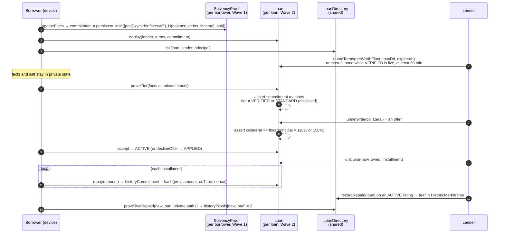

# Kymider - prove solvency privately, post 110% collateral instead of 150%

[](https://github.com/Turnless/kymider/actions/workflows/ci.yml)
[](https://turnless.github.io/kymider/)
[](https://midnight.network/)
[](./LICENSE)

**Midnight Buildathon · Wave 2 · Compact + MidnightJS**

DeFi lenders cannot assess a borrower without seeing their finances, so every
borrower posts the same over-collateral, typically 150%. Kymider lets a borrower
prove in zero knowledge that their committed balance, debts and income clear the
lender's bar. The `Loan` contract then accepts only one collateral figure from
the lender: the tier's, which is 110% for a verified borrower. That figure is
an offer. The loan becomes binding only when the borrower accepts it. The
verdict, the collateral and the repayment schedule settle on Midnight's public
ledger. The figures behind the verdict stay in the borrower's private state and
never enter a transaction.

> **A lender can only offer the tier's figure (110% for a verified borrower),
> and only the borrower can make it binding:** 10,000 borrowed against 11,000
> collateral, not 15,000.

| Live console | Video | Deck | On-chain proof | Tests | What is simulated |
|---|---|---|---|---|---|
| [turnless.github.io/kymider](https://turnless.github.io/kymider/) | [{{VIDEO_URL}}]({{VIDEO_URL}}) | [DECK.html](./hackathon/wave2/DECK.html) · [PDF]({{DECK_PDF_URL}}) | Devnet in [CI](https://github.com/Turnless/kymider/actions/workflows/ci.yml) on every push; Preprod pending ([details](#on-chain-evidence-devnet-now-preprod-pending)) | 307 offline, 46 browser, 18 devnet ([below](#tests-and-scripts)) | Money: no token moves. Console: contracts run in-browser, no proofs ([details](#what-is-real-and-what-is-not)) |

---

## Judge fast path

Five minutes, no keys, nothing to install. Every refusal you see below is the
contract's own `assert` message, raised by the compiled `Loan` and
`LoanDirectory` contracts running in your browser.

1. **Open** <https://turnless.github.io/kymider/> and click **Open the console**.
   You start as the borrower. **Private facts** holds your balance, debts and
   income; only their salted commitment is on the ledger.
2. **Apply.** Borrower → **Loans**. In the form, set principal **10,000**,
   interest **10**% (the form starts at 8), **3** installments. Beside it:
   collateral **$11,000** with a solvency proof (110%), **$15,000** without
   (150%). Keep the lender as **Harbor Bank**: the lender console acts as
   Harbor Bank unless you pick another lender under **Acting as** in the lender
   rail, and it lists only the applications made to that lender. Click
   **Apply to Harbor Bank**: this deploys a `Loan` instance bound to your facts
   commitment and lists it in the `LoanDirectory`.
3. **Quote.** Switch to **Lender** (role switch: bottom-left on desktop,
   top-right on a phone) → **Applications** → the loan → **Send quote**
   (net worth ≥ $500,000, DTI ≤ 40%, valid 72 h). The page shows "Quote 1 of 3".
4. **Prove the tier.** Switch to **Borrower** → **Loans** → the loan →
   **Prove tier**. The `proveTier` circuit checks your facts against the
   on-ledger commitment and the quote, and writes one value: here
   **Verified · 110%**.
5. **Watch the contract refuse 150%.** As the lender, open the loan again. The
   desk shows **11,000 (110%)**; under "What you can see, and what you cannot",
   balance, debts and income are listed as never leaving the borrower. Click
   **Ask for 150% anyway · 15,000**: the contract refuses with
   `collateral does not match the tier`. Click **Replace quote** to try to
   clear the tier: refused too, with `a verified tier is live until it lapses`.
6. **Offer, then accept.** **Offer at 110% · 11,000** records the lender's
   offer; the desk reads "Waiting for the borrower to accept" and nothing binds
   yet. Switch to **Borrower** → the loan. Under "Your step · Accept or
   decline", "Harbor Bank offers $11,000 collateral (110%)": click **Accept**
   (the `accept` circuit); **Decline** would run `declineOffer` and reopen the
   application. The loan is now **Active**. Switch back to **Lender** → **Disburse**: 11,000
   owed in installments of 3,667, 3,667 and 3,666.
7. **Repay, once late.** As the borrower, on the loan: **+31 days** (the demo
   block clock), then **Repay $3,667**. It is recorded late, by block time, not
   by the borrower. **Repay $3,667**, **+30 days**, **Repay $3,666**: **Repaid
   in full**, 3 payments, 1 late. The payment log sits next to the public
   record; both show the same amounts, because each amount is a transaction
   input.
8. **Record, then prove two repaid loans.** As the lender: **Record repayment in
   the directory**. As the borrower, apply for a second loan; on it, under
   **Prove two repaid loans**, tick two of your repaid loans and click
   **Prove two repaid loans**. The lender's application list now shows
   **2 prior repaid loans proven**. The proof does not say which loans,
   lenders or amounts. It does not hide that your key has repaid loans:
   listings are public ([limits](#honest-limits)).
9. **Auditor check (Wave 3 preview).** On the repaid loan: **Open history to an
   auditor** → **Copy JSON**. Switch to **Auditor** → paste →
   **Verify against the chain**: **Verified**, "3 payments, 1 late, $11,000
   repaid". Change one amount in the JSON and verify again: **Rejected**. This
   is an integrity check, not a disclosure of secrets
   ([why](#the-auditor-preview-integrity-not-secrecy)).
10. **On chain.** **Live chain** reads deployed instances through the
    indexer. Preprod is not deployed yet, so today it shows "Not deployed to
    Preprod yet". The proven run is in CI on a local devnet
    ([on-chain evidence](#on-chain-evidence-devnet-now-preprod-pending)).

This exact path runs in CI as a Playwright test at desktop and phone width
([`frontend/e2e/fast-path.spec.ts`](./frontend/e2e/fast-path.spec.ts)).

---

## What a judge's review found, and what we changed

Before resubmitting we had the `wave2` branch reviewed the way a judge would:
clone, build, follow this README literally, then try to break the headline
claim. Four findings changed the code. Each one is listed with what was
measured and what changed.

| Finding | What was measured | Change | Status |
|---|---|---|---|
| **The 150% bypass.** The contract refused 150% for a verified borrower, but the lender could clear the tier first | In the console as it then shipped: after **Verified · 110%**, the lender clicked **Replace quote**, then **Underwrite at 150% · 15,000**, and the contract accepted it. `quoteTerms` reset the tier to `NONE`. Two more paths, confirmed against the compiled `Loan`: a quote expiring 2 s later let the tier lapse, and the lender could underwrite at 150% before the borrower proved anything. The loan went `ACTIVE` with no borrower action | `underwrite` now records an offer (status `OFFERED`) at exactly the tier's collateral. The borrower's `accept` makes it `ACTIVE`; `declineOffer` returns it to `APPLIED`. `quoteTerms` is refused while a `VERIFIED` tier is live (`a verified tier is live until it lapses`) and needs a quote of at least 30 minutes (`quote must hold at least 30 minutes`). Tests: `Loan — a lender cannot impose 150% on a verified borrower` and `Loan — borrower consent` in [`loan.contract.test.ts`](./tests/unit/loan.contract.test.ts) | Done |
| **Unsalted facts commitment** | `persistentHash([balance, debts, income])` was public. A dictionary search recovered the demo facts after 3,973 hashes in 0.15 s (multiples of 100,000 up to 2,000,000), 193,826 hashes in 4.28 s (multiples of 50,000 up to 5,000,000) and 3,999,730 hashes in 84 s (multiples of 10,000 up to 2,000,000), on one core | `persistentHash([pad(32, "kymider:facts:v2"), H(balance, debts, income), salt])`, with a 32-byte salt that stays in private state | Done ([privacy hardening](#privacy-hardening-in-wave-2)) |
| **Seed prefix in a log line** | The wallet logged the first 8 characters of the master seed. Actions logs on a public repository are public | The line no longer logs any part of the seed (`2bee4e6`). The Preprod job had not run yet, so only devnet wallets had reached a log | Done |
| **Forgeable listings** | `LoanDirectory.updateStatus` let either party set any status, so a borrower could mark their own listing `REPAID`. `recordRepaid` did not check the listing's status | `REPAID` only through the lender's `recordRepaid` on an `ACTIVE` listing (`only an active listing can be recorded as repaid`); `updateStatus` refuses `REPAID` (`a repayment is recorded with recordRepaid, not set`); the borrower can only withdraw an `OPEN` listing. Tests in [`loanDirectory.contract.test.ts`](./tests/unit/loanDirectory.contract.test.ts): `nobody sets REPAID by hand: not the borrower, not the lender`, `the borrower may withdraw an open listing, and do nothing else`, `refuses a record for a listing that is not ACTIVE: never activated, closed or defaulted` | Done |

The review also found stale claims in this README and the submission
materials, and this revision corrects them: test counts, "the lender learns
one bit" (it is up to 3 answers per loan), an unsalted hash in the diagram, an
unbacked mutation-testing figure, and the auditor described as revealing
what the ledger cannot show when it checks integrity. The console's copy had
the same kind of error ("Only you see this list" on public listings); that
line is gone from `frontend/src`, and the copy was revised with the lifecycle
change.

---

## What changed since Wave 1

Wave 1 shipped a solvency proof (`SolvencyProof` + `Registry`). Wave 2 turns it
into a loan with an enforced price. All of the following was built between
Sep 27 and Oct 17, 2026, on the [`wave2`](https://github.com/Turnless/kymider/tree/wave2) branch.

| | Wave 1 | Wave 2 |
|---|---|---|
| Contracts | 2 (`SolvencyProof`, `Registry`), 9 circuits | 4: + [`Loan`](./contracts/loan.compact) (9 circuits) and [`LoanDirectory`](./contracts/loanDirectory.compact) (4 circuits); 22 circuits in total, plus exported pure helpers |
| What a proof buys | A PASS/FAIL attestation | A collateral ratio: 110% vs 150%, enforced in-circuit with an exact-floor check, binding only on the borrower's acceptance |
| Lifecycle | Claim → verdict | Apply → quote → prove tier → lender offers → borrower accepts → disburse → repay / default |
| Time | None | Block time: quote expiry, a minimum quote life, due dates, late flags, a 3-day grace period before default |
| History | None | Payment-history hash chain per loan; two-repaid-loans proof over a `HistoricMerkleTree` |
| Offline tests | 49 | 307 in 12 files |
| Browser tests | None | 46 Playwright tests at 1440 and 390 px, in CI |
| Devnet simulation | 11 cases, 2 wallets | 18 cases (+7 Wave 2 lifecycle), run in CI on every push |
| Client | `KymiderClient` | + [`LoanClient`](./client/loans.ts), `npm run loan:deploy`, `npm run loan:demo`, `prove:onchain` / `verify:onchain` |
| Console | Solvency screens | + loan screens for borrower and lender, portfolio, auditor preview, Live chain view |
| Chain | Local devnet only | Local devnet in CI on every push, with every transaction recorded and re-read; indexer-backed Live view. Preprod: workflow ready, run pending the owner's wallet |
| AKINDO record | Repo not connected, product private, tagged "Base" | Pending, owner only: connect the repo, make the product public, tag Midnight |

What Wave 1 judges asked entries for, and where it is now
([analysis](./hackathon/wave1-results.md)): *say exactly which parts need privacy* (see
the [dual-ledger table](#the-dual-ledger-what-is-private-what-is-public));
*add audio to the video* (the Wave 2 video is narrated); *show a public-testnet
transaction* (pending: [on-chain evidence](#on-chain-evidence-devnet-now-preprod-pending)).

---

## The problem

Over-collateral is the price DeFi lending pays for knowing nothing about the
borrower. A protocol cannot ask for bank statements, so it treats every borrower
as the worst case and asks for 150% or more. A borrower with a clean balance
sheet pays the same as one without.

The obvious fix, disclosing finances to the lender, is the one the setting
cannot accept: it puts a full financial history on a public chain or in a
counterparty's database. The lender does not even want the data. It wants one
answer: does this borrower clear our bar?

Kymider gives the lender that answer, at most 3 times per loan, and fixes the
price that follows from it. At 110% instead of 150%, the same collateral
supports 36% more borrowing (1.5 / 1.1 = 1.36), or the same loan needs 27% less
collateral (4,000 of 15,000).

---

## How it works



The full state machine is in [`contracts/loan.compact`](./contracts/loan.compact)
(header comment) and [`docs/architecture-wave2.md`](./docs/architecture-wave2.md).

### Why the borrower accepts

The tier fixes the only collateral figure the lender can offer, but a figure
the lender proposes is not yet a loan. Until the borrower accepts, the lender
can at worst make an offer the borrower declines: a 150% offer before the
borrower has proven a tier, or after a tier has lapsed. Combined with no
re-quote while a verified tier is live and a 30-minute minimum quote life, the
lender has no sequence of calls that turns a verified borrower's loan into an
active 150% loan.

### Why one `Loan` instance per loan

On Midnight, private state belongs to one contract instance. A shared loan
contract would have to hold every borrower's secrets, or none. One instance per
loan keeps each borrower's history seed and payment nonces scoped to that loan,
and lets every circuit check its caller against two keys stored at deploy
(`borrower`, `lender`). The shared `LoanDirectory` holds only public listings
and Merkle leaves.

### Why the client computes the quotients

Compact has no division operator. Collateral (`principal × 1.1`), amount owed
(`principal × (1 + rate)`) and installment (`owed / n`) are all quotients. The
client computes them in [`client/proof/loanMath.ts`](./client/proof/loanMath.ts)
and the circuit checks each one by cross-multiplication: `isFloorOfBps` accepts
`value` only if `value × 10000 ≤ principal × ratio < (value + 1) × 10000`, and
`isCeilOfShare` does the same for the ceiling. This is why a 150% ask on a
verified borrower is refused rather than tolerated: only the exact floor of
110% passes. [`tests/unit/loanMath.unit.test.ts`](./tests/unit/loanMath.unit.test.ts)
sweeps terms from a principal of 1 to 2^40 through both to prove they agree.

### Why payment nonces are derived, not random

Each repayment folds `(amount, on-time flag, nonce)` into the public
`historyCommitment`. The nonce is `hash("kymider:loan:nonce:", historySeed,
previousHead)` ([`contracts/witnesses.ts`](./contracts/witnesses.ts)). Nothing
has to be stored per payment, a failed transaction cannot desynchronise private
state from the chain, and the borrower can rebuild every opening from one seed.
It is keyed to the chain head rather than `paymentsMade` because `repay`
increments the counter before the witness runs.

---

## Midnight integration

| Compact / Midnight feature | Where | What it does here |
|---|---|---|
| Witnesses | `localSk`, `factsSalt`, `paymentNonce` in [`loan.compact`](./contracts/loan.compact); implementations in [`witnesses.ts`](./contracts/witnesses.ts) | The caller's secret key, the facts salt and the derived payment nonce enter circuits from private state |
| `disclose()` | Every ledger write of a caller-supplied value, e.g. `tier = disclose(qualified ? VERIFIED : STANDARD)` | Makes each disclosure explicit; the compiler rejects an undisclosed private value reaching the ledger |
| `persistentHash` commitments | `commitFacts` (salted), `getDappPubKey`, the history chain, `repaidLeaf` | Binds proofs to committed facts; derives identities; commits payment history |
| `HistoricMerkleTree` + `checkRoot` | `LoanDirectory.repaid`, `proveTwoRepaid` | Proves membership of two repaid-loan leaves against any past root, so later inserts do not invalidate a path |
| Block time | `blockTimeLt/Lte/Gt/Gte` in `quoteTerms`, `underwrite`, `disburse`, `repay`, `markDefault` | Quote expiry and minimum quote life, tier expiry, on-time vs late, the grace period, a disburse start no more than 1 hour old |
| `Counter` | `paymentsMade`, `latePayments`, `quotesIssued`, `listingCount` | Public counts the lender can rely on |
| `Map` / `Set` | `listings`, `historyProofs`, `recordedLoans` (directory); `claims`, `authorizedLenders`, `openClaims` (Wave 1) | Indexes and one-shot guards (a loan is recorded once) |
| Enums and structs | `LoanStatus`, `Tier`, `LoanTerms`, `Quote`, `Listing` | Typed public state |
| MidnightJS | [`client/loans.ts`](./client/loans.ts): `deployContract`, `submitCallTx`, indexer public data provider, LevelDB private-state provider | Deploy, prove locally, submit, read state back |
| `compact-runtime` in the browser | [`frontend/src/lib/`](./frontend/src/lib/) | The console runs the same compiled contracts client-side |

### The dual ledger: what is private, what is public

| Datum | Ledger | Who can see it |
|---|---|---|
| Balance, debts, income | **Private** (borrower's device); circuit inputs to `proveTier` only | Borrower |
| Facts commitment `persistentHash([pad("kymider:facts:v2"), H(balance, debts, income), salt])` | Public, and copied into every `Loan` opened with it | Anyone; reveals nothing without the facts and the 32-byte salt ([why the salt](#privacy-hardening-in-wave-2)). The same value in several loans links them |
| Facts salt | **Private** (borrower's device) | Borrower |
| Borrower secret key, history seed, payment nonces | **Private** | Borrower |
| Borrower and lender public keys | Public | Anyone |
| Quote: net-worth floor, max DTI, expiry; quotes issued | Public | Anyone |
| Tier (`VERIFIED` / `STANDARD`) and its expiry | Public | Anyone. Each tier answers one yes/no question against a public bar; up to 3 per loan |
| Offer, acceptance, terms, collateral, balance owed, installment, due date | Public | Anyone. A lender must be able to enforce them |
| Each repay amount, `paymentsMade`, `latePayments`, `historyCommitment` | Public | Anyone. `repay` takes the amount as a disclosed input, and the late counter's change per transaction shows which payment was late |
| Listings: borrower key, lender key, principal, status | Public | Anyone. A key's `REPAID` listings can be counted |
| Which loans back a two-repaid-loans proof, their lenders and Merkle paths | **Private** (circuit inputs to `proveTwoRepaid`) | Borrower |
| The fact that an application carries a 2-loan history proof | Public | Anyone |

The privacy claim is narrow on purpose: **the facts behind the tier are
private, and so is which loans back a history proof.** The loan itself,
including every payment, is public, because a lender has to be able to enforce
it.

---

## Rubric by rubric

Mapped to the criteria in [`hackathon/program.md`](./hackathon/program.md).

### Engineering & Implementation (40%)

- **Compact contracts that compile:** 4 contracts, 22 circuits plus
  exported pure helpers, Compact language 0.23 / toolchain 0.31.1, compiled by
  the `contracts` job in [CI](./.github/workflows/ci.yml) on every push;
  compiled modules are tracked in [`compiled/*/contract/`](./compiled/).
- **Private-state management:** [`contracts/witnesses.ts`](./contracts/witnesses.ts)
  (`LoanPrivateState = { sk, historySeed, factsSalt }`), scoped per contract address in
  [`client/loans.ts`](./client/loans.ts).
- **Dual-ledger model:** [table above](#the-dual-ledger-what-is-private-what-is-public).
- **Refusals as the product:** the exact-floor collateral check, no re-quote
  while a verified tier is live, borrower acceptance, block-time lateness, a
  grace period enforced to the second, forged Merkle paths rejected by
  `checkRoot`.
- **Repository and attribution:** Apache-2.0, `midnightntwrk` topic, wallet and
  provider wiring adapted from `midnightntwrk/example-battleship` (credited in
  each file).

### Quality Assurance & Reliability (15%)

- **307 offline tests** in 12 files that drive the
  compiled contracts through simulators ([`tests/unit/`](./tests/unit/)),
  including every refusal, time edge cases to the second, and a byte-for-byte
  rebuild of the history chain from the seed.
- **46 Playwright tests** on the production console build, at 1440
  and 390 px: this README's fast path end to end, each refusal, and every route
  ([`frontend/e2e/`](./frontend/e2e/)).
- **18 devnet cases** with real ZK proofs, two wallets, Midnight node + indexer
  + proof server in Docker, on every push
  ([`tests/simulation/`](./tests/simulation/)). First full green run:
  [run 34](https://github.com/Turnless/kymider/actions/runs/37092735681), on
  commit `5a56372`, before the salted commitment and the consent step
  ([scope](#on-chain-evidence-devnet-now-preprod-pending)).

### Product & Vision (15%)

- One checkable number: 110% instead of 150%.
- Scope stated honestly: lifecycle demo, no token settlement, self-reported
  facts, so a `VERIFIED` tier is free today ([honest limits](#honest-limits)).
- Roadmap tied to the limits: attested provenance and a lender allowlist close
  the two largest gaps ([Wave 3](#roadmap)).

### User Experience & Design (15%)

- A console that runs the real contracts with no install, for borrower, lender
  and auditor.
- A Live view that reads deployed instances through the indexer. Connecting
  Lace is built but untested on Preprod (pending the Preprod deployment).
- Works at phone width; the Playwright suite checks every route at 390 px for
  horizontal scroll.

### Communication (10%)

- Narrated video, about 2:50: [{{VIDEO_URL}}]({{VIDEO_URL}}).
  Script: [`hackathon/wave2/VIDEO-SCRIPT.md`](./hackathon/wave2/VIDEO-SCRIPT.md).
- Deck: [`hackathon/wave2/DECK.html`](./hackathon/wave2/DECK.html).

### Business Development & Viability (5%)

- **Who:** DeFi lending protocols that want a lower-collateral tier without
  KYC; borrowers with balance sheets the protocol cannot currently see.
- **Adoption path:** one protocol adds a verified tier; the borrower generates
  one proof per loan; no regulatory change is needed. The tier is worth a lower
  price only once facts are attested (Wave 3); until then it proves the
  mechanism, not the borrower.

---

## What is real and what is not

| Part | Status |
|---|---|
| Contracts, circuits, asserts | Real. Compiled by CI; the same modules run in tests, the console and the client |
| ZK proofs | Real on the local devnet in CI (simulation, `prove:onchain`). Preprod: pending. **Not** generated in the browser console: it executes circuits with `compact-runtime` and skips proving |
| Console chain | Simulated in-browser ledger with a controllable block clock. The Live view reads Preprod's indexer; nothing is deployed there yet, and it says so |
| Money | **Simulated.** Collateral, principal and balances are figures in contract state. No token is minted, locked or moved |
| Financial facts | Self-reported. The circuit proves arithmetic on committed figures; it cannot know they are true |
| Lace wallet | Live view only, untested on Preprod; the console's simulated mode needs no wallet |

---

## On-chain evidence: devnet now, Preprod pending

- **Every CI run** ([workflow](https://github.com/Turnless/kymider/actions/workflows/ci.yml),
  job "Devnet simulation") starts a local Midnight devnet in Docker, runs the
  18 simulation cases with real ZK proofs, then `npm run prove:onchain`
  (the full flow, every transaction recorded) and `npm run verify:onchain`
  (re-reads each claim and transaction through the indexer). The record is
  uploaded as the `proof-local` artifact of that run.
- **On the final contracts:** [run 38](https://github.com/Turnless/kymider/actions/runs/37098203726)
  (commit `b815b26`: salted commitment, quote cap, consent step, listing
  lockdown) proved the full flow in **31 transactions** and `verify:onchain`
  passed **45 of 45 checks**: Loan A offered and accepted at 110% (1,100 on
  1,000), Loan B at 150% (3,000 on 2,000), both repaid and recorded, Loan C
  carrying a two-loan history proof. Every address and transaction hash is in
  [DEVNET-PROOF.md](./DEVNET-PROOF.md), labelled as a local devnet.
- **Preprod: pending the owner's wallet.** [`preprod.yml`](./.github/workflows/preprod.yml)
  runs the same proof on Preprod when dispatched with a funded wallet secret
  and commits `PROOF.md` and `frontend/public/deployments/preprod.json`.
  Neither exists yet, so the Live view shows "Not deployed to Preprod yet".

---

## Threat model

| Attack | Defence | Evidence |
|---|---|---|
| Lender asks a verified borrower for 150% | `underwrite` accepts only `floor(principal × ratio)` for the live tier | `Loan — underwriting` tests; e2e `fast-path.spec.ts` |
| Lender re-quotes to wipe a `VERIFIED` tier, then asks 150% | `quoteTerms` is refused while a `VERIFIED` tier is live: `a verified tier is live until it lapses` | `a live VERIFIED tier cannot be re-quoted away, up to its last second`; `re-quoting after a VERIFIED proof is refused, so the tier stands and 150% is refused` |
| Lender quotes with a 2-second expiry so the tier lapses before underwriting | A quote must stand for at least 30 minutes: `quote must hold at least 30 minutes` | `refuses a quote that holds less than 30 minutes, to the second`; `a quote short enough to lapse before underwriting is refused` |
| Lender underwrites at 150% before the borrower proves | `underwrite` only records an offer; the loan is `ACTIVE` only after the borrower's `accept`, and `declineOffer` refuses it | `a 150% offer before the borrower can prove binds no one: decline, prove, be offered 110%`; `refuses a disbursement before the borrower accepts`; e2e `refusals.spec.ts` |
| Borrower proves with figures other than the committed ones | `proveTier` recomputes the salted commitment in-circuit | `refuses facts that do not match the commitment` |
| Dictionary attack on the public facts commitment | 32-byte salt in private state ([details](#privacy-hardening-in-wave-2)) | `privacy.contract.test.ts` |
| Lender narrows net worth by re-quoting | At most 3 quotes per loan, one proof per quote | `Loan — re-quote cap` tests |
| Borrower reuses a tier after the quote lapses | Tier expires with the quote; the lender's only valid offer is then 150%, which the borrower may decline | `a lapsed tier falls back to 150%` |
| Borrower claims a late payment was on time | Lateness is `blockTimeLte(nextDueAt)`, not an input | `a payment after its due date counts as late` |
| Lender calls a default early | `blockTimeGt(nextDueAt + 3 days)` | `refuses a default within the grace period, up to its last second` |
| Lender back- or forward-dates disbursement | Start must satisfy `now ≤ block time < now + 1 h` | `refuses a start time in the future or more than an hour old` |
| Anyone acts in another's role | Every circuit checks `getDappPubKey(localSk())` against `borrower` or `lender` | auth-negative tests in every `describe` block |
| Leaking the facts through control flow | `proveTier` reads the quote before the private predicate (a ledger read inside a short-circuit `&&` would leak) | [`loan.compact`](./contracts/loan.compact) comment; caught by the compiler |
| Borrower marks their own listing `REPAID` | `REPAID` only through the lender's `recordRepaid` on an `ACTIVE` listing; the borrower can only withdraw an `OPEN` listing | `nobody sets REPAID by hand: not the borrower, not the lender`; `the borrower may withdraw an open listing, and do nothing else`; `refuses a record for a listing that is not ACTIVE: never activated, closed or defaulted` |
| Forged or borrowed repayment record | Leaf includes the borrower's key; `checkRoot` against the directory's root history; distinct loans; not the application itself | `LoanDirectory` tests (forged path, someone else's record, same loan twice, self-vouching) |
| Facts commitment from a different `SolvencyProof` | No cross-contract reads on Midnight; the lender checks `factsMatchSolvencyProof` before quoting | [`client/loans.ts`](./client/loans.ts) |
| Wallet seed in public CI logs | No part of a seed is logged | commit `2bee4e6` |

**Not defended (see [honest limits](#honest-limits)):** false facts,
self-lending to mint repayment records, a lender recording an `ACTIVE` loan as
repaid early, linkability of a borrower's key across listings, and public
payment amounts.

### Privacy hardening in Wave 2

Two leaks in the first version, both closed in the contracts:

| Leak | Before | After | Evidence |
|---|---|---|---|
| Dictionary attack on the public facts commitment | `persistentHash([balance, debts, income])`, unsalted. Trying round figures recovered the demo facts 1,000,000 / 300,000 / 1,000,000 on one core, in Node with the Compact runtime's own `persistentHash`: multiples of 100,000 up to 2,000,000 after 3,973 hashes in **0.15 s**; multiples of 50,000 up to 5,000,000 after 193,826 hashes in 4.28 s; multiples of 10,000 up to 2,000,000 after 3,999,730 hashes in 84 s (about 45,000 hashes/s) | `persistentHash([pad(32, "kymider:facts:v2"), hash(facts), salt])` with a 32-byte random salt per commitment, held in private state and read through the `factsSalt` witness, never a transaction input. The same search now also has to guess 2^256 salts | [`privacy.contract.test.ts`](./tests/unit/privacy.contract.test.ts): a grid search finds the facts without the salt and not with it; a wrong salt is refused (`facts do not match committed facts`); an all-zero salt is refused (`facts salt must be set`) |
| Re-quote binary search | A lender could re-quote a loan without limit; each quote plus tier proof answers one yes/no question about net worth against a bar the lender picks | At most 3 quotes per loan (`quotesIssued`, `quote limit reached`) and one `proveTier` per quote (`tierProven`, `already proven against this quote`): at most 3 answers, counted on the public ledger. Bisecting net worth over [0, 2^20) stops with 131,072 values still possible | `Loan — re-quote cap` tests; the console shows "Quote n of 3" |

`updateFacts` draws a fresh salt every time, so a new commitment cannot be
linked to the old one by equality even when the figures are unchanged. A
Loan keeps the salt of the commitment it was opened with, so the lender's
binding check (`factsMatchSolvencyProof`) still compares two public hashes.

Each new loan opened against the same commitment allows up to 3 more answers.
The console shows the borrower whether the facts clear a bar before proving
("Preview on this device"), so the borrower can decline to prove; a failed
proof publishes `STANDARD`.

Not capped: Wave 1 `SolvencyProof` claims. A lender can re-request after each
decision, and every round needs a new proof from the borrower; the Wave 1
screens do not yet show a refusal for a cap, so it is left for Wave 3.

### The auditor preview: integrity, not secrecy

The Wave 3 preview lets a borrower export a loan's payment log (amounts,
on-time flags, nonces) and an auditor recompute the hash chain against the
loan's on-chain `historyCommitment`. A match proves the log is complete and
unaltered: nothing added, dropped, reordered or edited.

It does not reveal anything secret. Each repay amount is a disclosed input of a
public `repay` transaction, and the change in `latePayments` per transaction,
with block times, shows which payment was late. What the export adds is the
nonces, so the auditor can check the whole history against one hash without
running an indexer query per transaction. Private payment amounts would make it
a real selective disclosure; that needs token settlement and is not built.

---

## Tests and scripts

Totals are from `npm run test:unit` and `cd frontend && npm run e2e` on this
branch: 307 offline tests in 12 files, and
46 browser tests. Per-file counts: `npx vitest run tests/unit --reporter=verbose`.

| Suite | Drives |
|---|---|
| [`loan.contract.test.ts`](./tests/unit/loan.contract.test.ts) | Compiled `Loan`, own block clock: quotes, tiers, offers, acceptance, repayment, default |
| [`privacy.contract.test.ts`](./tests/unit/privacy.contract.test.ts) | Salted commitment, re-quote cap, the dictionary search with and without the salt |
| [`loanDirectory.contract.test.ts`](./tests/unit/loanDirectory.contract.test.ts) | Compiled `LoanDirectory`: listings, status rules, records, `proveTwoRepaid` |
| [`loanMath.unit.test.ts`](./tests/unit/loanMath.unit.test.ts) | Client arithmetic vs compiled `Loan`, principal 1 to 2^40 |
| [`audit.unit.test.ts`](./tests/unit/audit.unit.test.ts) | The auditor's off-chain chain rebuild, honest and tampered |
| [`simulatedLoanDesk.unit.test.ts`](./tests/unit/simulatedLoanDesk.unit.test.ts) | The console's loan desk on the real contracts |
| [`chainReader.unit.test.ts`](./tests/unit/chainReader.unit.test.ts) | The Live view's indexer decoding, fed state from the compiled contracts |
| [`proof.unit.test.ts`](./tests/unit/proof.unit.test.ts) | `prove:onchain` / `verify:onchain`: receipts, deployments file, PROOF.md rendering |
| [`solvencyProof.contract.test.ts`](./tests/unit/solvencyProof.contract.test.ts) | Compiled `SolvencyProof` (Wave 1) |
| [`registry.contract.test.ts`](./tests/unit/registry.contract.test.ts) | Compiled `Registry` (Wave 1) |
| [`solvencyProof.unit.test.ts`](./tests/unit/solvencyProof.unit.test.ts) | Reference circuit math (Wave 1) |
| [`frontend/e2e/`](./frontend/e2e/) | Playwright: fast path, refusals, every route, Wave 1 screens; desktop 1440 and phone 390 |
| [`wave1.simulation.test.ts`](./tests/simulation/wave1.simulation.test.ts) | Devnet, real proofs (CI), 11 cases |
| [`wave2.simulation.test.ts`](./tests/simulation/wave2.simulation.test.ts) | Devnet, real proofs (CI), 7 cases |

CI ([`ci.yml`](./.github/workflows/ci.yml)) compiles the contracts, typechecks
and runs the unit tests, builds the console, runs the Playwright suite,
publishes the console to Pages (from `main`), and runs the Docker devnet
simulation followed by `prove:onchain` and `verify:onchain` against that
devnet. [`preprod.yml`](./.github/workflows/preprod.yml) runs the same proof on
Preprod when dispatched with a funded wallet secret.

| Command | What it does |
|---|---|
| `npm run test:unit` | 307 offline tests, no Docker |
| `npm run typecheck` | `tsc --noEmit` |
| `cd frontend && npm run e2e` | 46 Playwright tests on the production build |
| `npm run build:contracts` | Compile all 4 contracts (Linux-only compiler) |
| `npm run compile:fast` | Same, skipping ZK key generation |
| `npm run env:up` / `env:down` | Start / stop the local devnet (node, indexer, proof server) |
| `npm run wait:dust` | Wait until the genesis wallet has DUST to pay for proofs |
| `npm run test:simulation` | Wave 1 + Wave 2 devnet simulation |
| `npm run deploy` / `npm run demo` | Wave 1: deploy + register; end-to-end solvency demo |
| `npm run loan:deploy` | Deploy the shared `LoanDirectory`, write `.midnight-loans.json` |
| `npm run loan:demo` | Open, prove, offer, accept, disburse and repay one loan; from the third run, also prove two repaid loans |
| `npm run check-balance` | Print a wallet's balances |
| `npm run prove:onchain` / `npm run verify:onchain` | Run the flow on the configured network and record every transaction (devnet in CI, Preprod via `preprod.yml`, written to `PROOF.md`); re-read the record through the indexer. `verify:preprod` checks the Preprod record |

---

## Running it

**Console, locally** (no Docker, no wallet):

```sh
git clone https://github.com/Turnless/kymider && cd kymider/frontend
npm install && npm run dev          # http://localhost:3000
```

**Offline tests** (Node 22+):

```sh
npm ci
npm run test:unit
```

**Full ZK flow** (Docker and the Linux-only `compact` compiler):

```sh
npm run env:up            # node, indexer, proof server
npm run build:contracts
npm run wait:dust
npm run test:simulation   # Wave 1 + Wave 2, two wallets, real proofs
npm run loan:deploy && npm run loan:demo
```

Network presets (`local`, `preview`, `preprod`) are in
[`client/config.ts`](./client/config.ts); copy [`.env.example`](./.env.example)
to `.env`. Setup details and troubleshooting: [`docs/scaffold.md`](./docs/scaffold.md).
On Windows use `npm.cmd`. If you have neither Docker nor the compiler, CI runs
all of it on every push.

---

## Honest limits

- **Unaudited.** No external review of the contracts or the client.
- **Self-reported facts, so `VERIFIED` is free.** Zero knowledge proves the
  arithmetic on committed figures, not that the figures are true. Anyone can
  commit a balance that clears any bar and get 110%. Until facts are attested,
  a lender has no economic reason to trust the tier; the demo shows the
  mechanism. Attested provenance (a data provider co-signs the facts) is the
  Wave 3 fix.
- **No token settlement in Wave 2.** Collateral and repayments are figures in
  contract state. Real escrow is a post-Buildathon milestone.
- **Payment amounts are public.** `repay` discloses each amount, and the late
  counter shows which payment was late. Only the facts and the history proof's
  loans are private.
- **The history proof hides which loans, not how many.** Listings are public and
  name the borrower's key, so an observer can count a key's `REPAID` listings
  and recompute their leaves. The facts commitment is also copied into each
  loan opened with it. Per-loan keys would close this; they are not built.
- **A repayment record is only as good as its lender.** `recordRepaid` cannot
  read the `Loan` (no cross-contract reads), so a lender can record an `ACTIVE`
  loan as repaid before it is. A borrower who lends to themselves from a second
  key can mint records. A lender allowlist is the Wave 3 fix.
- **Up to 3 answers per loan.** Each `proveTier` answers one comparison against
  a public quote; a loan caps this at 3 quotes and one proof per quote
  ([privacy hardening](#privacy-hardening-in-wave-2)). Each new loan against the
  same commitment allows 3 more.
- **Lender clock latitude.** `disburse` accepts a start time up to 1 hour old,
  so the lender can pull every due date up to 1 hour earlier.
- **Off-chain facts binding.** The check that a `Loan`'s commitment matches the
  borrower's `SolvencyProof` runs in the client, not in a circuit.
- **Browser console skips proving.** It executes the circuits; it does not
  generate proofs or use a wallet.
- **Preprod: pending.** Deployment runs from a manual CI job once the owner's
  funded wallet secret is added; until then on-chain evidence is the CI devnet
  run ([on-chain evidence](#on-chain-evidence-devnet-now-preprod-pending)).

---

## Roadmap

**Wave 3 (Oct 27 – Nov 16):** detail in [`docs/architecture-wave3.md`](./docs/architecture-wave3.md).

- **Attested data provenance.** A data provider co-signs facts into private
  state at ingestion, so `VERIFIED` stops being free; the same mechanism
  restricts repayment records to allowlisted lenders.
- **Auditor views.** The preview already checks a payment history's integrity
  offline (`/app/audit`, [`contracts/audit.ts`](./contracts/audit.ts)). Wave 3
  adds a read-only regulator dashboard.
- **Bank channel.** Signed, expirable attestations a bank verifies offline,
  without running a Midnight node.
- **Per-loan borrower keys**, so listings stop linking a borrower's loans and
  the history proof hides the count.

---

## Repository

```
contracts/      solvencyProof, registry (Wave 1); loan, loanDirectory (Wave 2);
                witnesses.ts, index.ts, audit.ts
compiled/       compiler output; contract/ modules tracked, keys not
client/         KymiderClient (index.ts), LoanClient (loans.ts), CLIs, proof/loanMath.ts
scripts/        prove-onchain, verify-onchain, wait-for-dust
frontend/       React console; runs the compiled contracts in the browser; e2e/ Playwright
tests/unit/     offline contract tests + simulators
tests/simulation/  devnet simulations (CI)
docs/           architecture-wave1..3, scaffold
hackathon/      program rules, Wave 1 results, Wave 1 and Wave 2 submission material
```

## License and attribution

Apache-2.0 ([LICENSE](./LICENSE)). Wallet, provider and witness patterns are
adapted from [`midnightntwrk/example-battleship`](https://github.com/midnightntwrk/example-battleship)
(Apache-2.0), credited in the files that use them. Built with the
[Midnight](https://midnight.network/) Compact toolchain and MidnightJS. Repo
topic: `midnightntwrk`.
